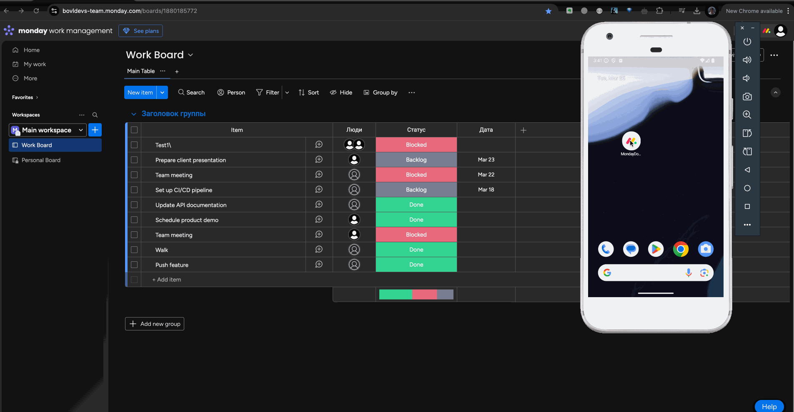

# Monday.com Android Demo App

This is a demo Android application that showcases working with the [Monday.com GraphQL API](https://developer.monday.com/api-reference/docs/introduction-to-graphql).

It uses a clean architecture approach with modern Android technologies including:

- Jetpack Compose
- Apollo GraphQL
- Hilt for dependency injection
- Kotlin Coroutines & Flow
- Material 3

## Features

- 📋 Fetch and display boards from Monday.com
- ✅ View board items grouped by status
- 🔄 Update item status using mutations
- 📦 Uses GraphQL schema: [`get_schema`](https://api.monday.com/v2/get_schema)
- 📚 API Reference: [developer.monday.com](https://developer.monday.com/api-reference/docs/introduction-to-graphql)
- 🧪 Includes unit tests for repository and interactor logic

## Setup

1. Clone the repository:

```bash
git clone https://github.com/yourusername/monday-android-demo.git
```

2. Open the project in Android Studio.

3. Add your Monday.com API token:

~~~
- Add your token to `local.properties`:
MONDAY_API_TOKEN=your_token_here
~~~

➡️ **Instead**, set `MONDAY_TOKEN` in `AppModule`.

4. Build and run the app.

## GraphQL

This project uses Apollo GraphQL to interact with the Monday.com API.

- GraphQL introspection: [`https://api.monday.com/v2/get_schema`](https://api.monday.com/v2/get_schema)
- Docs: [GraphQL API Reference](https://developer.monday.com/api-reference/docs/introduction-to-graphql)

## Testing

Includes unit tests for:

- `MondayRepositoryImpl`
- `MondayInteractorImpl`

Using `mockk`, Apollo testing support, and JUnit 5.

<h2>📽 Demo</h2>


## License

MIT License. This project is for learning and demo purposes only.
